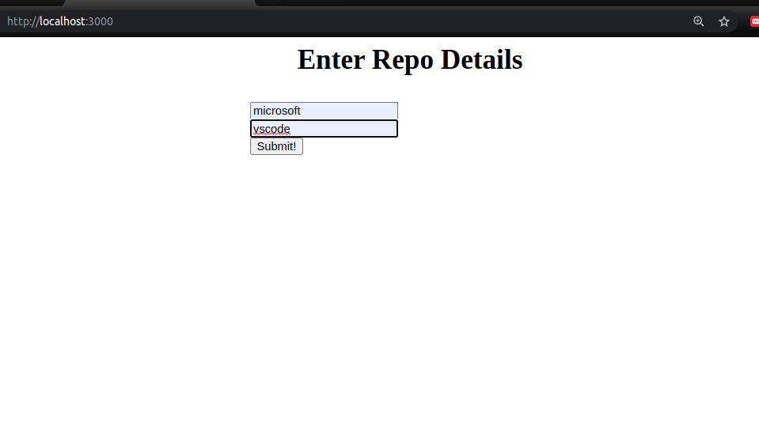
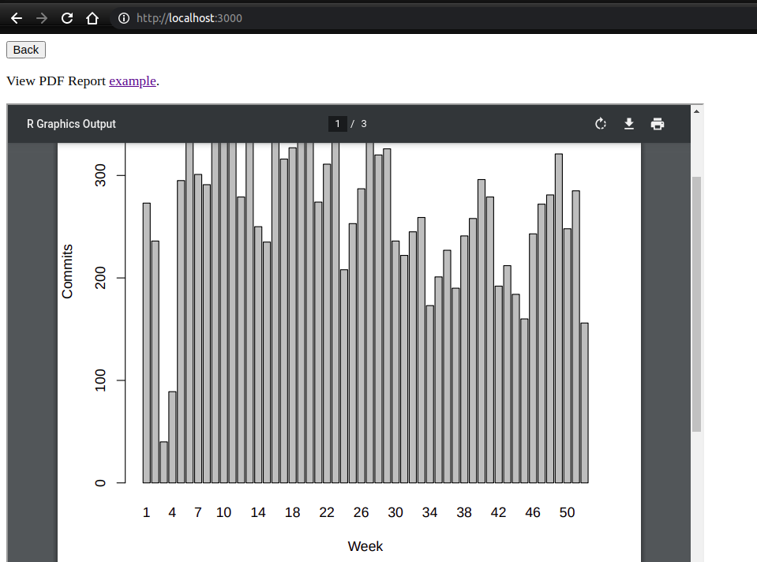
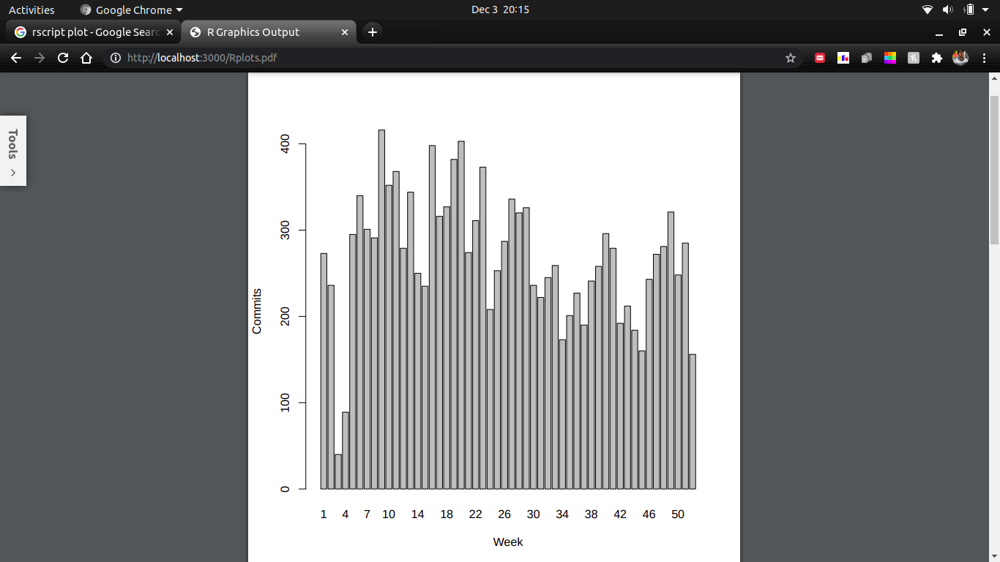
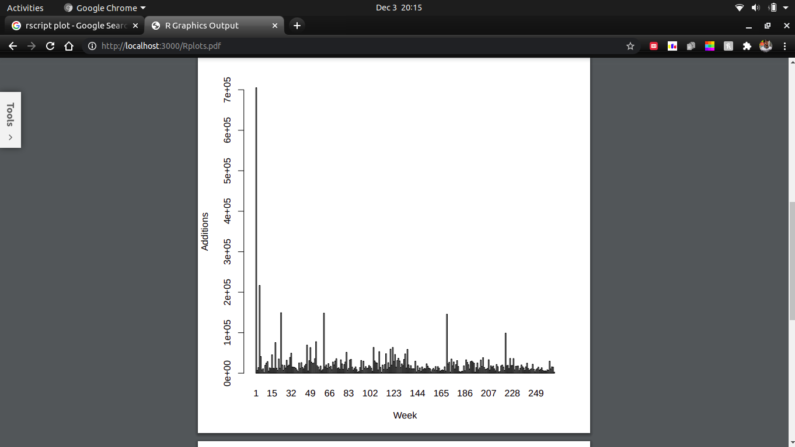
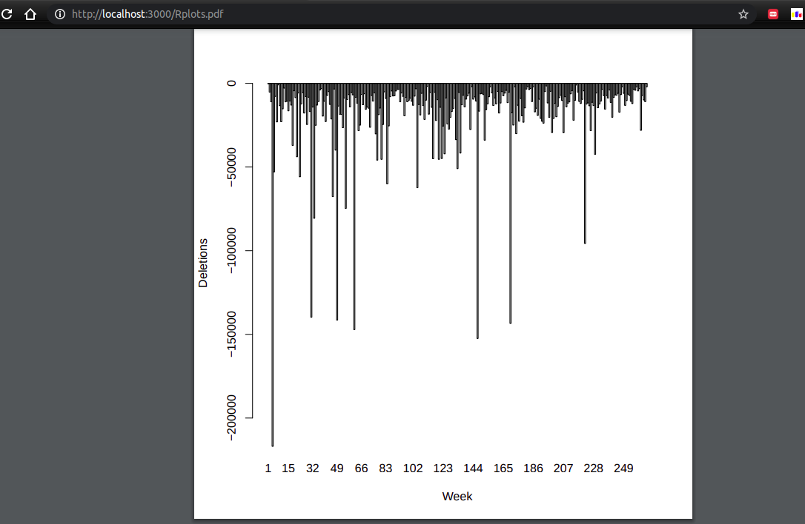

# REST API - Github Tracker

## Running the Project Locally
```
	git clone https://github.com/amankumarkeshu/Github-Tracker.git
	cd Github-Tracker
	sudo npm install 
	sudo bash R_Setup.sh
	# To quit R terminal
	q()
	sudo npm start

```
The project will be available at **http://localhost:3000/**.


## Structure
RESTful API, endpoints (URLs), API has GET, POST features present at the mentioned endpoints. It also has filtering features.

Endpoint |HTTP Method | CRUD Method | Result
-- | -- |-- |--
`/` | GET  | READ | Get Home page
`/` | POST | CREATE | Create a user and repo and search
`/index` | GET | READ | Get a single result


## Screenshot

## API Root

<br />

## GET

<br />

## GET Commit Data

<br />

## GET Number Of Lines Added per Week 

<br />
##  GET Number Of Lines Deleted per Week 

<br />
